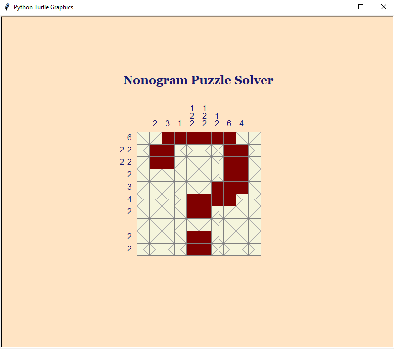
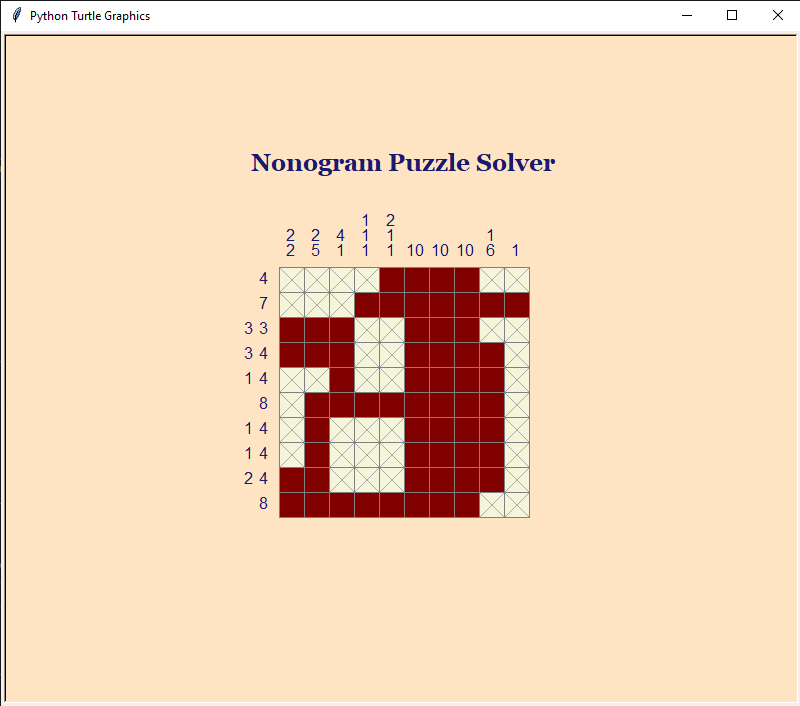
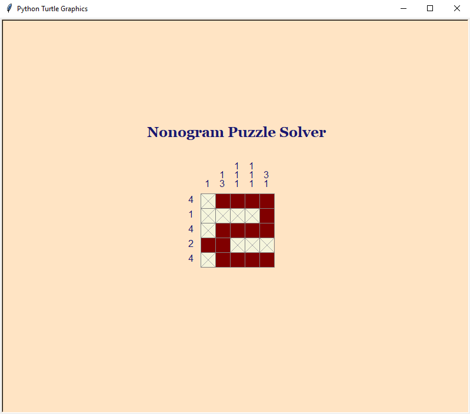
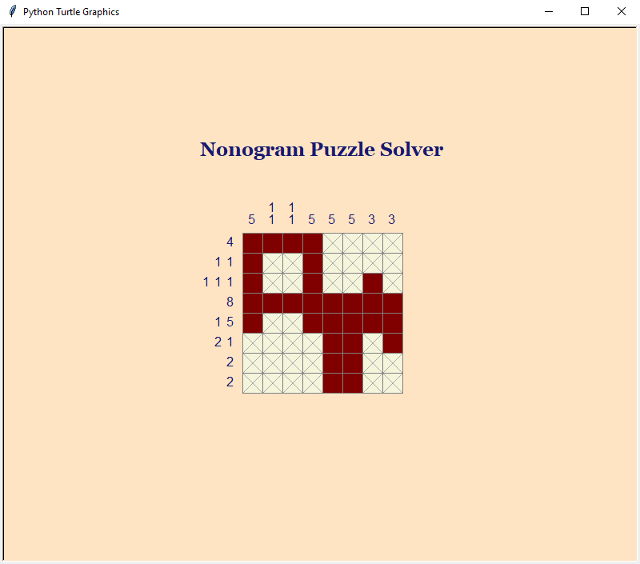
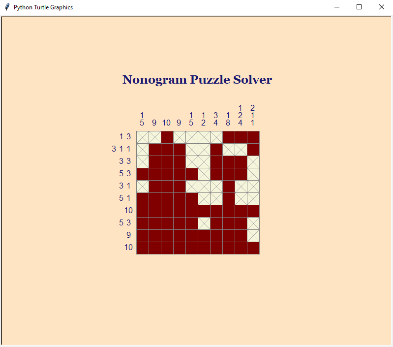
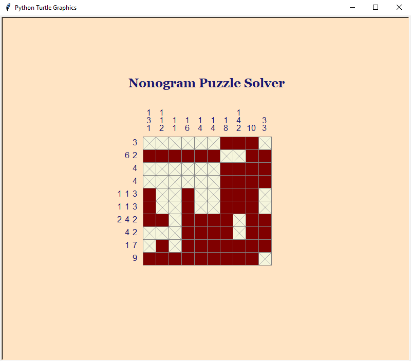

# 🧩 AI Nonogram Puzzle Solver via Simulated Annealing

**Group Members:**  
- **Mohid Arshad** — [GitHub](https://github.com/akamohid) | [LinkedIn](https://linkedin.com/in/mohid-arshad-347180235/)  
- **Mohammad Umar** — [LinkedIn](https://www.linkedin.com/in/mohammad-umar-1147a62a6/)  
- **Mohammad Hasnain** — [LinkedIn](https://www.linkedin.com/in/mohammad-hasnain-3670452a7/)

**GitHub Repo:** https://github.com/akamohid/AI-NONOGRAM-PUZZLE-SOLVER

---

## 📖 What Is a Nonogram?

A **Nonogram** (aka Picross or Paint-by-Numbers) is a logic-based puzzle where players fill or leave cells blank based on number clues for each row and column. A correct solution reveals a hidden image.

Each number represents a group of filled cells. For example, `[2, 1]` means "2 filled cells, then space(s), then 1 filled cell".

---

## 🔥 About This Project

This project uses the **Simulated Annealing** algorithm to solve Nonogram puzzles automatically:

- Start with a random filled grid.
- Evaluate how well it satisfies the puzzle constraints (fitness).
- Iteratively tweak the grid and improve it using simulated annealing's probabilistic approach.
- Continue until all row and column constraints are satisfied.

Includes:
- 🧠 Constraint validation
- 🔁 Random restarts to ensure convergence
- 🖼 Visualized output using Turtle graphics
- 🧪 Tests for fitness and logic

---

## 🔥 Key Features

- **Custom Clues**: Easily edit row/column constraints for any puzzle size.  
- **Random Restarts**: Robustly solves even hard puzzles by trying again.  
- **Flexible Grid**: Supports **N×M** puzzles of arbitrary shape.  
- **Adjustable Cooling**: Tweak starting temperature, cooling rate, and iterations.  
- **Unit Tested**: Ensures core fitness and state-flip logic are correct.  
- **Documentation**: Includes research paper, detailed report, and presentation slides.

---

## 📂 Repository Structure

```
AI-NONOGRAM-PUZZLE-SOLVER/
├── assets/ ← Project visual assets
│ └── outputs/ ← Turtle output screenshots
│ ├── Sample-output-1.png
│ ├── Sample-output-2.png
│ ├── Sample-output-3.png
│ ├── Sample-output-4.png
│ ├── Sample-output-5.png
│ └── Sample-output-6.png
├── docs/               ← Research paper (PDF)
│   └── research_paper.pdf
├── presentation/       ← Slides (PPTX)
│   └── slides.pptx
├── reports/            ← Written report (DOCX)
│   └── report.docx
├── src/                ← Solver source code
│   └── nonogram_solver.py
├── tests/              ← Unit tests
│   └── test_solver.py
├── .gitignore          ← Files to ignore in Git
├── LICENSE             ← MIT License text
├── CITATION.cff        ← Citation metadata
├── requirements.txt    ← Python dependencies (standard library only)
└── README.md           ← This guide
```

---

## 🛠 Installation & Setup

1. **Clone the repository**  
   ```bash
   git clone https://github.com/akamohid/AI-NONOGRAM-PUZZLE-SOLVER.git
   cd AI-NONOGRAM-PUZZLE-SOLVER
   ```

2. **(Optional) Create a virtual environment**  
   ```bash
   python -m venv venv
   source venv/bin/activate    # macOS/Linux  
   venv\Scripts\activate     # Windows
   ```

3. **Install (none!)**  
   This project uses **only the Python standard library**—no external dependencies.

---

## ▶️ Running the Solver

1. Open `src/nonogram_solver.py` in your editor.  
2. Locate the **“### EDIT BELOW FOR CUSTOM PUZZLE ###”** section:  
   ```python
   row_constraints = [
       [3], [1,1], [2], …  # example
   ]
   col_constraints = [
       [1], [4], [1,1], …
   ]
   ```  
3. Replace these lists with your own puzzle’s row and column clues.  
4. Run:
   ```bash
   python src/nonogram_solver.py
   ```  
5. Watch terminal logs for fitness progress, then see the final grid drawn in a **Turtle** window.

---

## 🧪 Testing

Validate core logic:

```bash
pytest tests/test_solver.py
```

All tests should pass, confirming fitness scoring and flips work as expected.

---

## 📐 Puzzle Example Used (Default)

You can modify `row_constraints` and `col_constraints` in `nonogram_solver.py`. Example:

```python
row_constraints = [[6], [2, 2], [2, 2], [2], [3], [4], [2], [], [2], [2]]
col_constraints = [[], [2], [3], [1], [1, 2, 2], [1, 2, 2], [1, 2], [6], [4], []]
```

---

## 🖼️ Sample Output Visualizations

Here are a few example solutions generated by our AI Nonogram Solver using Simulated Annealing:

<p align="center">
  
  
</p>
<p align="center">
  
  
</p>
<p align="center">
  
  
</p>


---

## 💾 Typical Git Workflow

```bash
git init
git remote remove origin 2>$null
git remote add origin https://github.com/akamohid/AI-NONOGRAM-PUZZLE-SOLVER.git
git add .
git commit -m "Initial commit: nonogram solver via simulated annealing"
git branch -M main
git push -u origin main
```

---

## ✅ Requirements

Works with Python 3.7 or higher. No extra packages required.

```
Python >= 3.7
Standard Library only (turtle, math, random)
```

---

## 👥 Team Members

- **Mohid Arshad** — [GitHub](https://github.com/akamohid) | [LinkedIn](https://linkedin.com/in/mohid-arshad-347180235/)  
- **Mohammad Umar** — [LinkedIn](https://www.linkedin.com/in/mohammad-umar-1147a62a6/)  
- **Mohammad Hasnain** — [LinkedIn](https://www.linkedin.com/in/mohammad-hasnain-3670452a7/)  

---

## 📄 License

This project is released under the **MIT License**.  
See [LICENSE](LICENSE) for full terms. 

---

## 📖 Citation

```bibtex
@misc{arshad2025nonogram,
  author       = {Arshad, Mohid and Umar, Mohammad and Hasnain, Mohammad},
  title        = {AI Nonogram Puzzle Solver via Simulated Annealing},
  year         = 2025,
  howpublished = {GitHub},
  url          = {https://github.com/akamohid/AI-NONOGRAM-PUZZLE-SOLVER}
}
```

---

## 📬 Contact & Feedback

Made with ❤️ by **Mohid Arshad**.  
✉️ Email: akamohid@gmail.com  
🔗 [LinkedIn](https://linkedin.com/in/mohid-arshad-347180235/)  

Feel free to open issues, propose enhancements, or leave a ⭐!

---

Happy puzzling and learning! 🐢✨
